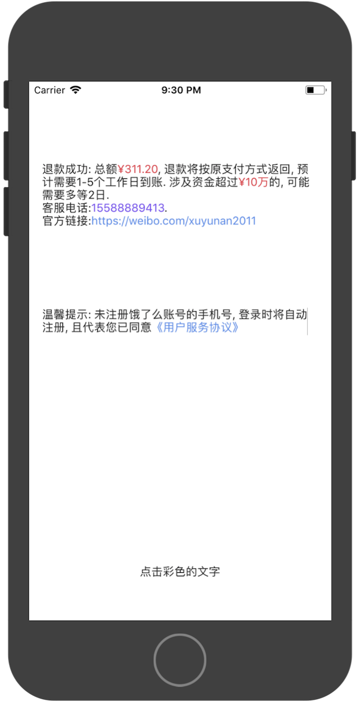

# YNSuperLabel

[]()
[]()
[]()

富文本Label

使用特定格式来标记特殊字符, 每种字符都可以通过Closure自定义样式.
目前支持的格式 `^price()` `^tel()` `^link()` 

Example

```Swift
let readme = YNSuperLabel(frame: CGRect(x: 16, y: 280, width: self.view.frame.size.width - 32, height: 0))
readme.backgroundColor = UIColor(red:0.28, green:0.28, blue:0.28, alpha:1.00)
readme.linkStyle = {
    var style = YNSuperLabelStyle()
    style.textColor = UIColor(red:0.31, green:0.53, blue:0.93, alpha:1.00)
    return style
}
readme.clickHandler = { (attr: YNSuperLabelAttr) in
    self.hintLabel.text = attr.content
    self.hintLabel.textColor = attr.textColor
}
readme.text = "温馨提示: 未注册饿了么账号的手机号, 登录时将自动注册, 且代表您已同意^link(《用户服务协议》)"
self.view.addSubview(readme)
```



## Installation

#### Using [CocoaPods](https://cocoapods.org)

Edit your `Podfile` and specify the dependency:

```ruby
pod "YNSuperLabel"
```


